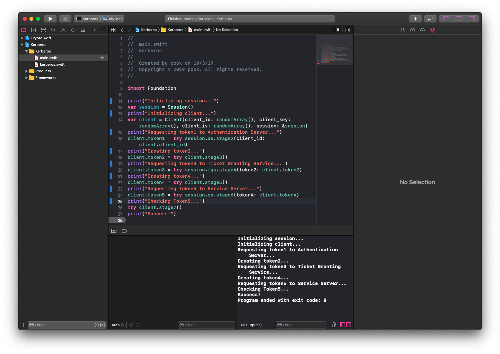

# Kerberos Modeling Swift

Swift로 코딩된 Kerberos Modeling입니다. 실제 Kerberos는 아니며 알고리즘만 구현했으며, 서버와 통신하지 않고 Swift 내의 class와 통신합니다.

[krzyzanowskim/CryptoSwift](https://github.com/krzyzanowskim/CryptoSwift)의 AES-128 암호화 기법을 사용했습니다. Wikipedia의 [Kerberos (protocol)](https://en.wikipedia.org/wiki/Kerberos_(protocol))을 참고했습니다.

macOS 10.15 Beta (19A582a), Xcode 11.2 beta에서 테스트했습니다. Swift 버전은 5.1.1이고 이는 현재 베타이므로 오류가 있을 수 있습니다.

이 문서는 발표용 자료입니다.

## 간단한 설명



이 프로젝트 안에는 2개의 파일이 있습니다.

- `main.swift` : 서버와 클라이언트를 정의하고 알고리즘을 실행하는 공간

- `kerberos.swift` : Kerberos의 알고리즘이 짜여진 공간

이 코드를 실행해서 문제가 없으면 아래와 같은 메시지가 나옵니다.

```
Initializing session...
Initializing client...
Requesting token1 to Authentication Server...
Creating token2...
Requesting token3 to Ticket Granting Service...
Creating token4...
Requesting token5 to Service Server...
Checking token5...
Success!
```
## 자세한 설명

Authentication Server는 AS, Ticket Granting Servic는 TGS, Service Server는 SS라고 줄이겠습니다.

또한 Ticket Granting Ticket은 TGT라고 줄이겠습니다.

1. 서버 세선 정의

`var session = Session()`

위 코드로 session이라 불리는 세션을 정의합니다. TGS와 SS의 Secret Key는 랜덤으로 자동으로 생성되며, 이 키들은 3개의 서버끼리 `protocol Server: AnyObject`로 공유됩니다.

2. 클라이언트 정의

`var client = Client(client_id: randomArray(), client_key: randomArray(), client_iv: randomArray(), session: &session)`

위 코드로 client라 불리는 클라이언트를 정의합니다. 클라이언트 ID와 클라이언트 Key, IV는 랜덤으로 생성되며, in-out parameter로 통해 session의 AS에 클라이언트의 정보를 등록합니다.

3.  AS에 Token1 요청

`client.token1 = try session.as.stage2(client_id: client.client_id)`

Token1에는

- messageA : 클라이언트의 키로 암호화된 TGS Session Key'

- messageB : TGS Secret Key로 암호화된 TGT (클라이언트 ID가 포함됨)'

들이 포함되어 있습니다. 이를 client.token1에 저장합니다.

만약에 해당 ID의 유저가 등록되어 있지 않을 경우 `AS_ERROR.ID_IS_NOT_MATCHING` 오류를 출력합니다. (등록은 2번 과정에서 합니다.)

4. 클라이언트가 Token2 생성

`client.token2 = try client.stage3()`

클라이언트는 Token1의 messageA를 자신의 클라이언트 Key로 복호화해서 TGS 세선키를 획득합니다. 그리고 Token2를 생성합니다.

Token2에는

- messageC : Token1의 messageA

- messageD : 획득한 TGS Session Key'로 암호화된 Authenticator (클라이언트 ID가 포함됨)

들이 포함되어 있습니다. 이를 client.token2에 저장합니다.

만약에 3번에서 Token1를 받지 못해서 client.token1 값이 비어있을 경우 `CLIENT_ERROR.TOKEN1_IS_NIL` 값을 출력합니다.

5. TGS에 Token2를 전송하고 Token3를 요청

`client.token3 = try session.tgs.stage4(token2: client.token2)`

TGS는 Token2 안에 있는 messageC를 TGS Secret Key로 복호화해서 TGS 세선키를 획득합니다.

또한 messageC를 자신의 TGS Secret Key로 TGT를 복호화해서 클라이언트 ID (1번이라 칭함)를 획득합니다. 또한 messageD에서 자신의 TGS 세선키로 Authenticator를 복호화해서 클라이언트 ID (2번이라 칭함)를 획득합니다.

1번 ID와 2번 ID를 비교해서 일치하지 않을 경우 `TGS_ERROR.ID_IS_NOT_MATCHING` 오류를 출력합니다. 만약 일치하다면 Token3를 생성합니다.

Token3에는

- messageE : Server Secret Key로 암호화된 Client-to-server 티켓 (Server Session Key와 클라이언트 ID가 포함됨)

- messageF : TGS Session Key'로 암호화된 Server Session Key

들이 포함되어 있습니다, 이를 client.token3에 저장합니다.

만약에 4번에서 Token2를 생성하지 못해서 client.token2 값이 비어있을 경우 `TGS_ERROR.TOKEN2_IS_NIL` 오류를 출력합니다.

6. 클라이언트가 Token4를 생성

`client.token4 = try client.stage5()`

클라이언트는 4번 과정에서 획득한 TGS 세선키로 Token3의 messageF를 복호화해서 Server Session Key를 획득합니다. 이 키를 통해 Token4를 생성합니다.

Token4에는

- messageE : Token3의 messageE

- messageG : Server Session Key로 암호화된 새로운 Authenticator (클라이언트 ID가 포함됨)

들이 포함되어 있습니다. 이를 client.token4에 저장합니다.

만약에 5번에서 Token3를 받지 못해서 client.token3 값이 비어있을 경우 `CLIENT_ERROR.TOKEN3_IS_NIL` 오류를 출력합니다.

7. SS에 Token4를 전송하고 Token5를 요청

Server Session Key로 Token4의 messageG를 복호화해서 클라이언트 ID (4번이라 칭함)를 획득합니다.

SS는 Token4 안에 있는 messageE를 자신의 Server Secret Key로 복호화해서 Server Session Key와 클라이언트 ID (3번이라 칭함)를 획득합니다. 이 Server 3번 ID와 4번 ID를 비교해서 일치하지 않을 경우 `SS_ERROR.ID_IS_NOT_MATCHING` 오류를 출력합니다. 만약 일치하다면 Token5를 생성합니다.

Token5에는

- messageH : Server Session Key로 암호화된 timestamp

가  포함되어 있습니다. 이를 client.token5에 저장합니다.

만약에 6번에서 Token4를 생성하지 못해서 client.token4 값이 비어있을 경우 `SS_ERROR.TOKEN4_IS_NIL` 오류를 출력합니다.

8. 클라이언트가 Token5를 검사

클라이언트는 6번에서 획득한 Server Seesion Key로 Token5의 messageH를 복호화해서 timestamp를 획득해서 검사합니다. 만약 timestamp가 잘못 되었을 경우 `CLIENT_ERROR.INVALID_TIMESTAMP` 오류를 출력합니다.

만약에 7번에서 Token5를 받지 못해서 client.token5 값이 비어있을 경우 `CLIENT_ERROR.TOKEN5_IS_NIL` 오류를 출력합니다.

오류가 없을 경우 Success!가 출력됩니다.
